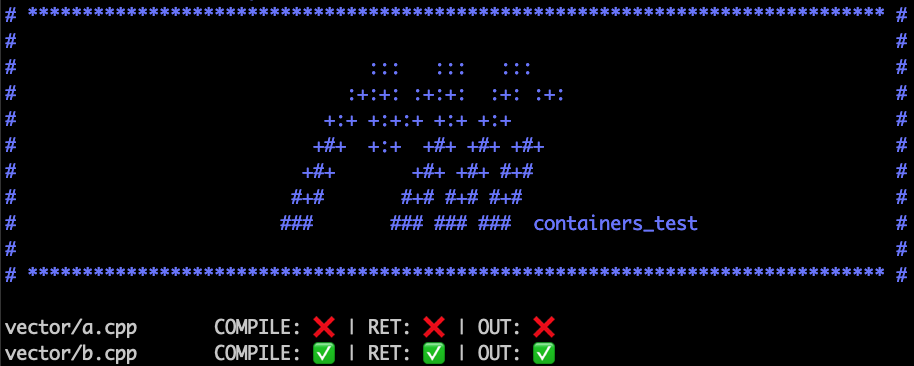

# containers_test

<p align="center">
	
</p>

## Usage

Go in your ft_containers' repository and:

```bash
git clone https://github.com/mli42/containers_test.git && cd ./containers_test/
```

Expected tree:

```
. [ft_container]
├── <container>.hpp
├── [...]
└── containers_test
    └── [...]
```

Then what?  
There are a few executables and here is their usage:

```bash
./do.sh [container_to_test] [...]
./cmp_one <path/to/test_file>
./one <file> [namespace=ft] [path/to/includes=..]
```

Examples:
```bash
./do.sh # to test every containers
./do.sh vector list # to test only your vector && list, for instance

./cmp_one srcs/list/size.cpp # to see the result comparison (ft/std) on this test file only

./one srcs/list/rite.cpp std # to see the output of this test file with the std
```

How to read the output ?
```
The [ ✅ / ❌ ] emojis shows if it has the same return as the STL, i.e if the STL and your implementation:
- compile the same way,
- return the same number,
- print the same output (if a a diff occurs, a deepthought is created).

THE [Y/N] shows if the STL compile (Y) or not (N), there are some test where you should not compile.
(If every test gives `N`, there is probably a problem with your `.h`.
```

## Tested features
- [x] vector
- [x] list
- [x] map
- [x] stack
- [x] queue
